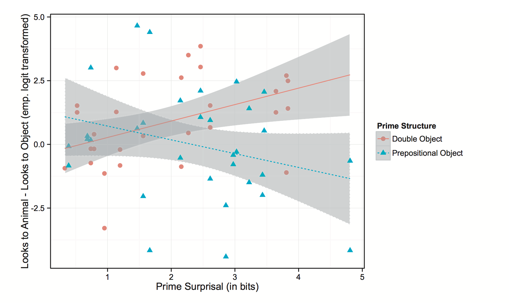

# Evidence for Implicit Learning in Syntactic Comprehension
Alex Fine and T. Florian Jaeger. 2013. Cognitive Science. [Link](http://onlinelibrary.wiley.com/doi/10.1111/cogs.12022/abstract)

## Their view of adaptation:
People accommodate to changing statistics in the environment. They leave it open whether this is linked in any ways to speakers or not. They see adaptation as a consequence of *error-based implicit learning* which assumes that behavior at a given time point, *t*, is influenced by an error signal relevant to that behavior at time *t–1*. That is, error-based implicit learning accounts predict that the prediction error from recently processed material, which can be interpreted as a gradient error signal, affects expectations about upcoming material.

## Research question:

Can *error-based implicit learning* explain the adaption behavior in a visual-world experiment?
 
## Experiments
 
 Reanalysis of [Thothathiri and Snedeker (2008)](http://www.sciencedirect.com/science/article/pii/S0010027708000115)
 
 
**Materials**: Context story followed by two primes that have the same structure (DO or PO). Probe trials either have the same or opposite structure.
 
**DO**: Now you can give the horse the apple.

**PO**: Now you can give the horn to the dog.

Tracked proportions of looks to animate/inanimate object during temporally ambiguous period (e.g., "hor..." for horse/horn). 

**DV**: looks to animate - looks to inanimate object

They first did a norming study where they had 171 turkers complete the probes given the context. From that they estimated the proposal *P(structure | context, verb, subject)*, where *structure* is either PO or DO.

Surprisal is then *-log P(structure | context, verb, subject)*.

They predict that there is an interaction between surprisal and prime structure; in the case of DO primes, *DV* should increase; in case of PO primes, *DV* should decrease. That's what they observe.

**Results**:

